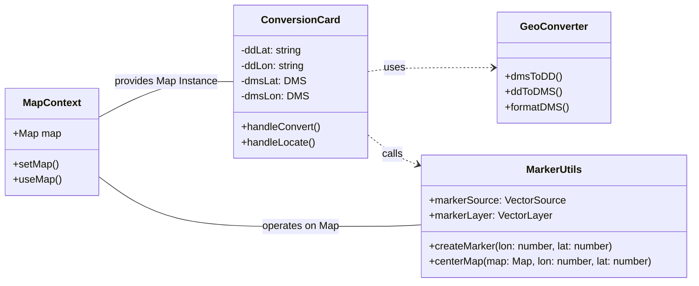
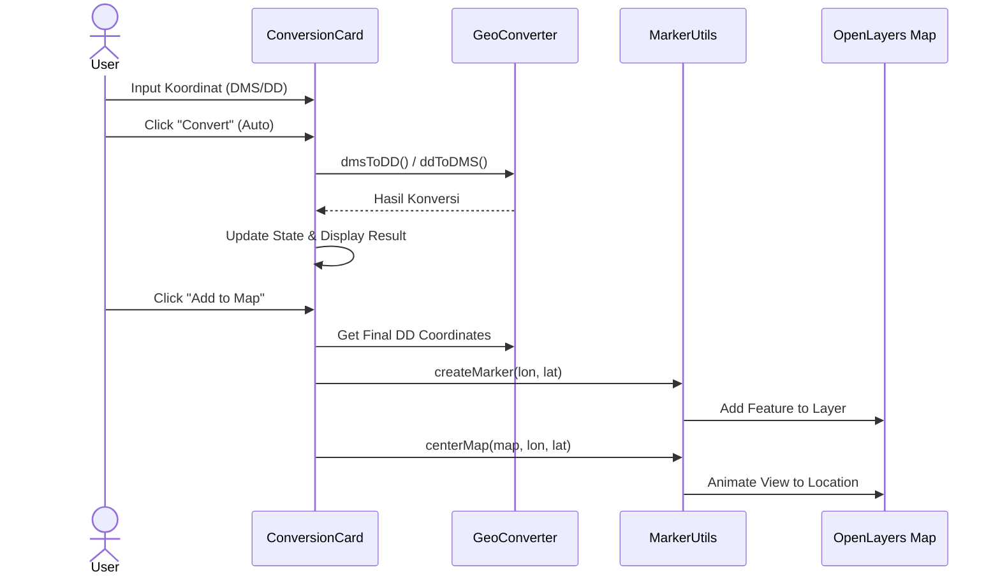

# Map-Len Project

Aplikasi pemetaan interaktif menggunakan React, TypeScript, dan OpenLayers untuk konversi koordinat dan visualisasi lokasi.

## 📋 Fitur Utama
*   **Peta Interaktif**: Menggunakan OpenLayers untuk menampilkan peta dasar.
*   **Konversi Koordinat**: Mengubah format DMS (Degrees Minutes Seconds) ke Decimal Degrees (DD) dan sebaliknya.
*   **Marker Management**: Menambahkan penanda pada peta berdasarkan lokasi yang dipilih atau diinput.
*   **Clean Code**: Menggunakan ESLint standar industri dan JSDoc untuk dokumentasi kode.
*   **Unit Testing**: Terintegrasi dengan Vitest (Jest-compatible) untuk menjamin akurasi perhitungan.

## 🛠️ Tech Stack
*   **Bahasa**: React v19, TypeScript v5.9
*   **Build Tool**: Vite v7
*   **Peta**: OpenLayers v10
*   **Styling**: TailwindCSS
*   **Testing**: Vitest, React Testing Library
*   **Linting**: ESLint v9

## 📐 Rencana Relasi (Class Diagram)

Diagram berikut menjelaskan hubungan antar modul utama dalam aplikasi:



## 🔄 Life Cycle / Process (Sequence Diagram)

Alur proses ketika pengguna melakukan konversi koordinat dan menampilkannya di peta:



## 📂 Struktur Folder

Aplikasi dirancang dengan struktur modular untuk kemudahan skalabilitas dan *reusability*.

```
src/
├── components/          # Komponen UI Reusable
│   ├── map/             # Komponen spesifik Peta
│   │   ├── MapContext.tsx   # Context Provider untuk Map instance
│   │   ├── MapBackground.tsx# Container div untuk peta
│   │   └── Marker.ts        # Logika/Utils untuk marker
│   ├── ConversionCard.tsx   # Widget konversi utama
│   └── Header.tsx           # Header aplikasi
├── types/               # Defines TypeScript interfaces
│   └── coordinate.d.ts  # Tipe data koordinat (DMS, DD)
├── utils/               # Fungsi Utilitas Murni (Pure Functions)
│   ├── geoConverter.ts      # Logika matematika konversi
│   └── geoConverter.test.ts # Unit tests untuk converter
├── App.tsx              # Main Layout
└── main.tsx             # Entry Point
```

## 🚀 Instalasi & Testing

Ikuti langkah berikut untuk menjalankan aplikasi di komputer lokal:

### Prasyarat
*   Node.js (v18 ke atas disarankan)
*   npm atau yarn

### Langkah Instalasi
1.  Clone repository ini (jika ada) atau ekstrak folder project.
2.  Buka terminal di root folder project.
3.  Install dependencies:
    ```bash
    npm install
    ```
4.  Jalankan mode development:
    ```bash
    npm run dev
    ```
    Buka `http://localhost:5173` di browser.

### Menjalankan Test
Untuk memastikan keakuratan perhitungan konversi, jalankan unit test:

```bash
npm test
```
*Gunakan `npm run lint` untuk mengecek standar kode.*

## 📝 Catatan Pengembang
*   **Reusable Components**: Folder `components/map` memisahkan logika peta `MapContext` dari UI. Hal ini memungkinkan komponen lain (seperti `ConversionCard`) mengakses peta tanpa perlu prop drilling yang dalam.
*   **Documentation**: Gunakan JSDoc (/** ... */) pada fungsi-fungsi publik agar intellisense berfungsi maksimal.
